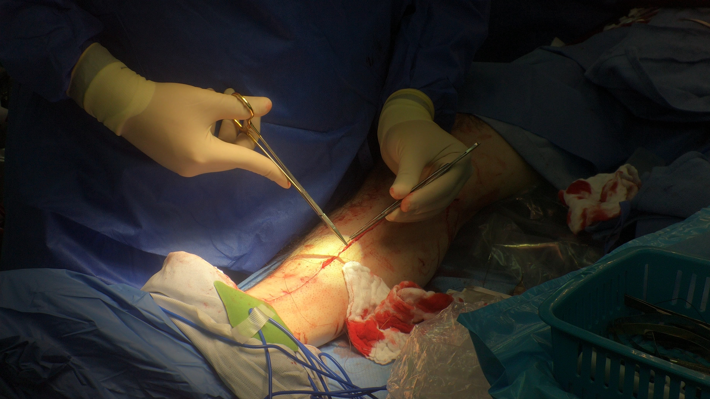
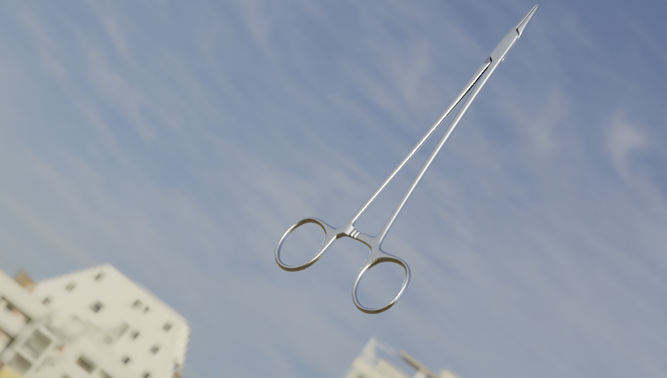
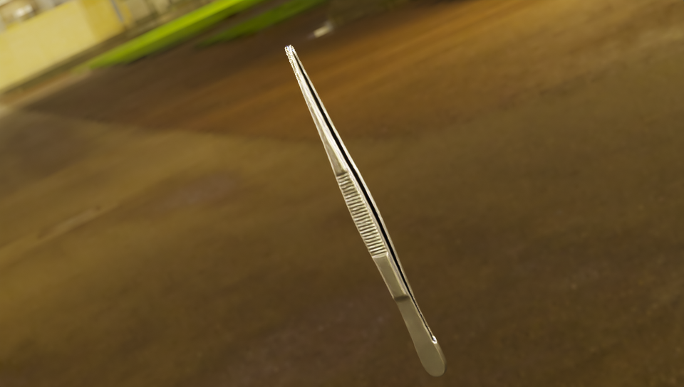
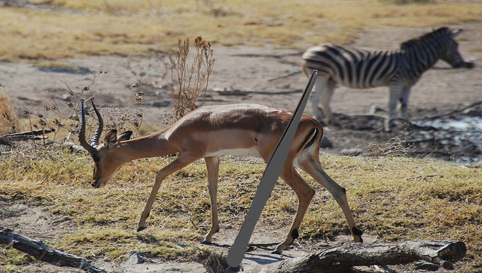
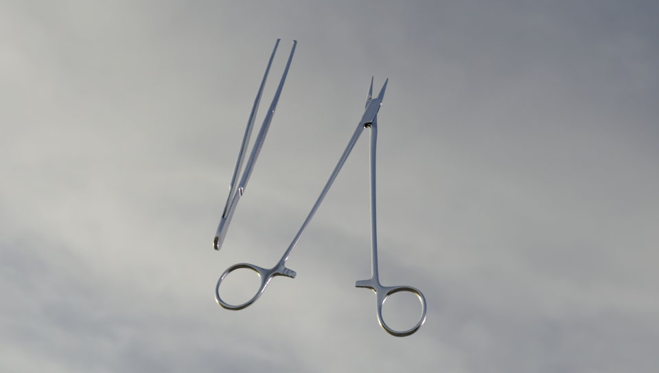
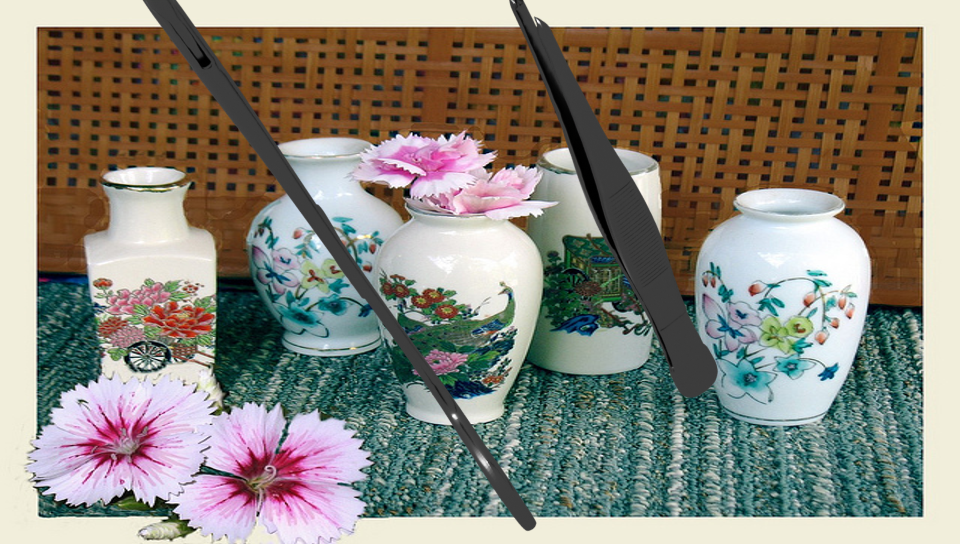

# Surgery tools object segmentation in leg surgery

This project tackles the problem of object segmentation in surgery. Our goal is to segment needle holders and tweezers in a surgical video of leg suturing.



Too accomplish this task we generate synthetic data using blender and blender-proc. [^1]

[^1]: [blender-proc github repository](https://github.com/goodfella47/Synthetic-data-tutorial/tree/master)

We generate in total 2,835 syntethic images:
1. 1,485 images with a single object: 
    - 995 are hdri images

    needle holder              |  tweezers
    :-------------------------:|:-------------------------:
      |  

    - 490 are non-hdri images pasted on a random background

    needle holder              |  tweezers
    :-------------------------:|:-------------------------:
      |  

2. 1,350 images with a both objects:
    - 900 hdri images:
    

    - 450 non-hdri images:
    

We use a ultralytics YOLO11n-seg pretrained segmentation model.[^2]

[^2]: [ultralytics segmentations website](https://docs.ultralytics.com/tasks/segment/)

The model is trained on the synthetic data and is adapted to real images using domain adaptation.

## Requirements and installation
To run the code you will need to create conda environment with the libraries that are in requirments.txt.

First copy the github repository:
```bash
git clone TBA
cd Visualization_project
```

To create the environment and install the libraries:
```bash
conda create --name synth --file requirements.txt
conda activate synth
```

## Running our code
### data generation:
to generate the synthetic data:
```bash
python synthetic_data_generator.py
```
This will create the synthetic data and save it in:

```
.
├── ...
├── Synth_dataset           # synthetic data with a single object in each picture
│   ├── hdri                # hdri images
│   └── non_hdri            # non-hdri images with random backgroudnd
├── Synth_dataset_two       # synthetic data with a single object in each picture
│   ├── hdri                # hdri images
│   └── non_hdri            # non-hdri images with random backgroudnd
└── ...
```

### model training:
To train the model on the synthetic data run:
```bash
python model_training.py
```

The result will be saved in:
```
.
├── ...
├── runs           
│   └── segment                
│       └── train       # the models weights and statistics of the training loop
└── ...
```

### domain adaptation:
To run a domain adaptation loop:
```bash
python domain_adaptation.py
```
However, the loop is quite long and if the code is being run on a server or through a dedicated machine i would suggest running:
```bash
nohup python domain_adaptation.py
```
This will result in the code to run on the machine with needing the computer to be awake.

Our domain adaptation consists of 20 iterations of training loops.
The result will be saved in:
```
.
├── ...
├── runs           
│   └── segment                
│       ├── train       # the models weights and statistics from the model_training.py
│       ├── train2      # the train loop result of iteration one
│       ├── ...
│       └── train21     # the final train loop results 
├── nohup.out           # the codes output
└── ...
```
each `train` directory is from a different iteration.

### predict on image
To run a prediction on an image:
```bash
python predict.py
```

The output will be saved in:
```
.
├── ...
├── output.jpg
└── ...
```
If you wish to change the model weights or the image that the model predicts on you can change the following line in the python file to your needs:

```python
IMAGE_PATH = "/the/path/to/your/image.png"
WEIGHTS = "/the/path/to/your/desired/weights.pt"
```
The current default values are a path to an image from the given dataset, and a path to our final model weights.

### predict on video
To run a prediction on an image:
```bash
python video.py
```

The output will be saved in:
```
.
├── ...
├── output_video.mp4
└── ...
```
If you wish to change the model weights or the video that the model predicts on you can change the following line in the python file to your needs:

```python
IMAGE_PATH = "/the/path/to/your/video.mp4"
WEIGHTS = "/the/path/to/your/desired/weights.pt"
```
The current default values are a path to the 4_2_24_A_1.mp4 video and a path to our final model weights.

## Our final model weights
Here is a link to download our final model weights:

[final model weights](./best_segmentation.pt)


## notes
For examples of synthetic images look at:
[image examples](./image_examples/)

Or look directly at the data we provide in: [images with a single tool](./synthetic_data/)
and [images with both tools](./synth_dataset_two/)


    

